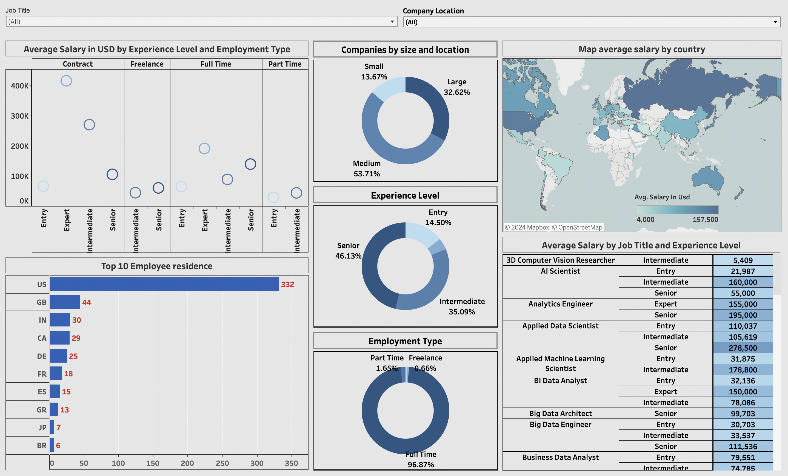

# Global Data Science Job Market Dashboard

## Overview

This Tableau dashboard provides a comprehensive visualization of the global Data Science job market. It offers insights into various job roles, salary distributions, and employment trends across different countries, experience levels, and employment types.

[Dashboard](https://public.tableau.com/shared/HGT867MYP?:display_count=n&:origin=viz_share_link)

## Features

- **Job Roles Distribution**: Visual representation of different Data Science job roles worldwide.
- **Salary by Employment Type**: Comparison of average salaries across full-time, part-time, and contract positions.
- **Experience Level Analysis**: Breakdown of job distributions and salaries by experience level.
- **Global Salary Map**: Interactive world map showing average Data Science salaries by country.
- **Dynamic Filtering**: Users can filter data by job role, country, and experience level for customized views.

## Data Sources

The dashboard utilizes a curated dataset comprising:
- Data Science job titles
- Geographic locations (countries)
- Employment types
- Experience levels
- Salary information

## Tools Used

- Tableau Desktop for dashboard creation

## Future Enhancements

- Integration with live data sources for real-time job market insights
- Addition of time-series data to show market trends over time
- Incorporation of skills and technologies data for more detailed analysis

Project Link: [Global Data Science Job Market](./DataScienceJobs_Analysis.twb)

